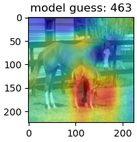

# NetDissect

This is an open source utility for analyzing Neural Net architectures


## PM Shell - PyTorch Model Debug Shell

## Overview

PM Shell is an interactive debugging and visualization shell for PyTorch convolutional neural networks (CNNs). It provides a command-line interface for inspecting models, visualizing layer activations, examining weights, and running inference on images.

## Getting Started

### Starting the Shell

```bash
cd <dir-where-pmshell_script_is>
pmshell
```

The shell will start with the prompt `>>` and display "Welcome to the shell!"

### Configuration

The shell looks for two configuration files in the current directory:

- **`.pmdebugrc`** - RC file with startup commands (executed automatically on launch)
- **`.pmdebug_history`** - Command history file (saved automatically on exit)

Following attributes can be specified in the .pmdebugrc file
- `dataset` - Path to dataset directory
- `image_path` - Path to image directory
- `checkpoint_path` - Path to checkpoint files
- `checkpoint_name` - Default checkpoint filename

Python commands that are desired to be executed everytime at startup can be included directly in 
the .pmdebugrc file, for example,

import torchvision.models as models

### Loading a model

  ```
  >> import torchvision.models as models
  >> model=models.resnet18(weights=ResNet18_Weights.DEFAULT)
  Resyncing model "model"
  >> set context model
  Context now is "model"
  >> 
  ```

### Load a sample image and run inference

  ```
  >> load image dog.jpg
  Loading image <'image_path' specified in .pmdebugrc>/dog.jpg
  >> show infer
  model:
  463        0.8
  600        0.7
  731        0.7
  412        0.6
  899        0.6
  ```

### Display heatmap of the image
See which area of the image is the model paying attention to.

  ```
  >> show heatmap
  model guess: 463
  >>
  ```




## Commands Reference

### Model Management

#### `set context [model_name]`
Set the current model context. If no name is provided, looks for a global variable named "model".
- **Aliases**: `set ctx`
- **Example**:
  ```
  >> model = resnet18()
  >> set context model
  ```

#### `resync [model_name]`
Resynchronize a model in context after modifications.
- **Example**: `>> resync model`

#### `nparams [model_name]`
Print the total number of parameters in a model.
- **Aliases**: `nparam`
- **Example**: `>> nparams model`

#### `summary`
Print PyTorch model layer summary.

### Loading Data

#### `load image [path]`
Load a single image from the specified path (relative to `config.image_path`).
- **Example**: `>> load image cat.jpg`

#### `image next`
Load the next image from the configured dataset.
- **Global variable**: Sets the global `image` variable

#### `load checkpoint [filename]`
Load a checkpoint file into the current model.
- **Aliases**: `load chkp`, `laod chkp`
- **Example**: `>> load checkpoint best_model.pth`
- If no filename is provided, uses `config.checkpoint_name`

### Dataset Management

#### `set dataset [path]`
Configure a dataset from the specified path.

#### `set class [index]`
Set the current class index in the dataset.
- **Example**: `>> set class 5`

#### `dataset suffix [suffix]`
Change dataset suffix (train/val/validation).
- **Example**: `>> dataset suffix val`

### Visualization Commands

#### `show image [image_var]`
Display an image array.
- **Aliases**: `show img`
- **Example**: `>> show image` (shows the global `image` variable)
- **Example**: `>> show image my_tensor`

#### `infer image [model_name]`
Run inference on the current image and display top-5 predictions.
- **Aliases**: `infer`
- **Example**: `>> infer image`
- Uses global `image` variable as input
- **Supports compare mode**

#### `show first layer weights [model_name/tensor]`
Display the first convolutional layer weights as a grid.
- **Aliases**: `show flw`
- **Example**: `>> show first layer weights`
- **Example**: `>> show first layer weights my_tensor`
- **Supports compare mode**

#### `show activations [model_name]`
Display layer activations as a bar graph for the current layer.
- **Aliases**: `show act`
- **Example**: `>> show activations`
- **Supports compare mode**

#### `activations next`
Load next image from dataset and show activations.
- **Aliases**: `act next`

#### `show weights [model_name]`
Display weights of the current layer as a bar graph.
- **Aliases**: `show weight`, `show wei`
- **Supports compare mode**

#### `show grads [model_name]`
Display gradients of the current layer as a bar graph.
- **Supports compare mode**

#### `show heatmap`
Display a class activation map (CAM) heatmap overlaid on the input image.
- **Aliases**: `show heat`
- Uses the last Conv2d and Linear layers
- **Supports compare mode**

#### `heatmap next`
Load next image from dataset and show heatmap.
- **Aliases**: `heat next`

#### `visualizer`
Start the interactive layer visualizer (requires a model and image loaded).

### Layer Navigation

#### `up`
Navigate up one layer in the model hierarchy.

#### `down`
Navigate down one layer in the model hierarchy.

### Post-Processing

#### `set post process [function]`
Set a post-processing function for data visualization.
- **Aliases**: `set postp`
- **Built-in options**:
  - `relu` - Apply ReLU activation
  - `mean` - Compute mean
  - `max` - Compute max
  - `none` - Remove post-processing
- **Custom function**: Provide a global function name
- **Example**:
  ```
  >> set post process relu
  >> set post process my_custom_fn
  ```

### Compare Mode

#### `set compare [model_name|image|flw]`
Enable dual-window comparison mode for visualizations.
- **Aliases**: `set comp`
- **Example**:
  ```
  >> set compare model2
  >> show activations  # Shows activations for both current model and model2
  ```
- **Options**:
  - `model_name` - Compare with another model
  - `image` - Compare with input image
  - `flw` - Compare with first layer weights
- **Disable**: `>> set compare` (no arguments)

### Variable Assignment

#### `assign layer [var_name]`
Assign the current layer to a global variable.
- **Default name**: `layer`
- **Example**: `>> assign layer my_layer`

#### `assign weight [var_name]`
Assign the current layer's weights to a global variable (detached clone).
- **Default name**: `weight`

#### `assign out [var_name]`
Assign the current layer's output to a global variable.
- **Default name**: `out`
- Requires running forward pass with an image

#### `assign outsq [var_name]`
Same as `assign out` but squeezes the batch dimension.

### Shell Commands

#### `quit`
Exit the shell.

#### Python Code Execution
You can execute arbitrary Python code directly in the shell:
```
>> import torch
>> x = torch.randn(1, 3, 224, 224)
>> print(x.shape)
```

Use `!` prefix to force Python evaluation:
```
>> !2 + 2
```

## Workflow Examples

### Example 1: Basic Model Inspection

```python
>> import torchvision.models as models
>> model = models.resnet18(pretrained=True)
>> set context model
>> nparams
>> show first layer weights
```

### Example 2: Image Inference

```python
>> load image dog.jpg
>> show image
>> infer image
# Top-5 predictions will be displayed
```

### Example 3: Layer Activation Visualization

```python
>> load image cat.jpg
>> set context model
>> down  # Navigate to desired layer
>> down
>> show activations
```

### Example 4: Heatmap Generation

```python
>> load image bird.jpg
>> show heatmap
# Displays image with CAM overlay showing important regions
```

### Example 5: Model Comparison

```python
>> model1 = resnet18()
>> model2 = resnet34()
>> set context model1
>> load checkpoint model1.pth
>> set compare model2
>> infer image  # Shows predictions from both models
```

### Example 6: Weight Analysis with Post-Processing

```python
>> set context model
>> set post process relu
>> show weights
# Displays weights with ReLU applied
```

## Advanced Features

### RC File (.pmdebugrc)

Create a `.pmdebugrc` file in the working directory to execute commands on startup:

```bash
# .pmdebugrc example
import torchvision.models as models
model = models.resnet18(pretrained=True)
set context model
load checkpoint best_model.pth
```

### Command Shortcuts

The shell supports multi-word commands with spaces:
- `load image` → `load_image`
- `show first layer weights` → `show_first_layer_weights`

### Global Variables

Key global variables available:
- **`model`** - The current neural network model
- **`image`** - The currently loaded image tensor

## Technical Details

### Image Format
- Images are automatically resized to 224x224 pixels
- Images are converted to PyTorch tensors with shape (1, C, H, W)
- Supported formats: Any format supported by PIL

### Model Format
- Models must be PyTorch `nn.Module` instances
- Models are automatically set to CPU mode
- Checkpoint files should contain a `model` key in the state dict

### Visualization
- Uses matplotlib for all visualizations
- Supports both single and dual-window modes
- Interactive event handling for some visualizations

## Troubleshooting

### Common Issues

1. **"No default model is set"**
   - Solution: Use `set context model_name` to set a model

2. **"Please load an input image first"**
   - Solution: Use `load image path` or configure a dataset

3. **"Current layer has no weights"**
   - Solution: Navigate to a layer with learnable parameters (e.g., Conv2d, Linear)

4. **Module loading errors**
   - Ensure all dependencies are in PYTHONPATH
   - Check that `pm_base.py`, `pm_helper_classes.py`, and `layer_visualizer.py` are accessible

## Dependencies

- Python 3.x
- PyTorch
- torchvision
- numpy
- matplotlib
- PIL (Pillow)

## File Structure

```
Common/tools/src/
├── pmshell              # Main shell executable
├── pm_base.py           # Base shell functionality
├── pm_helper_classes.py # Helper classes (Window, Dataset, ModelMeta, etc.)
└── layer_visualizer.py  # Interactive layer visualizer
```

## Tips

1. Use Tab completion for commands (readline support)
2. Command history is saved between sessions
3. Use Ctrl+C to interrupt long-running operations
4. Combine commands with Python expressions for powerful debugging
5. Use compare mode to visualize differences between models or layers
6. The shell maintains context, so you don't need to reload models/images repeatedly
